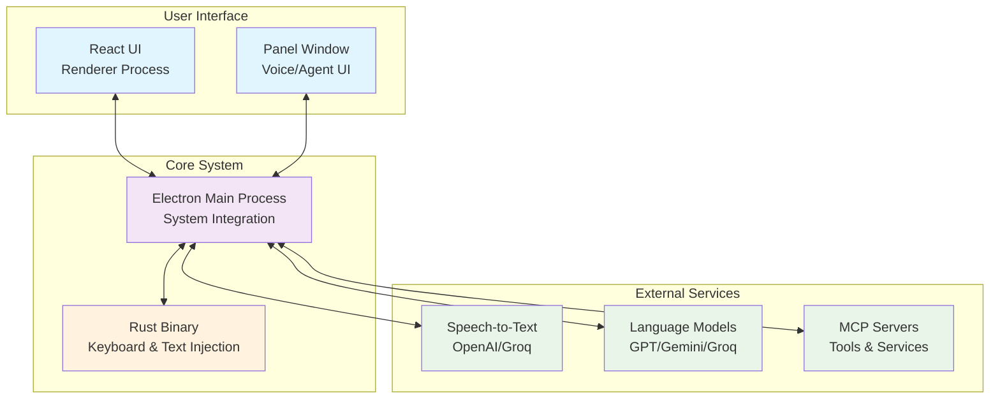
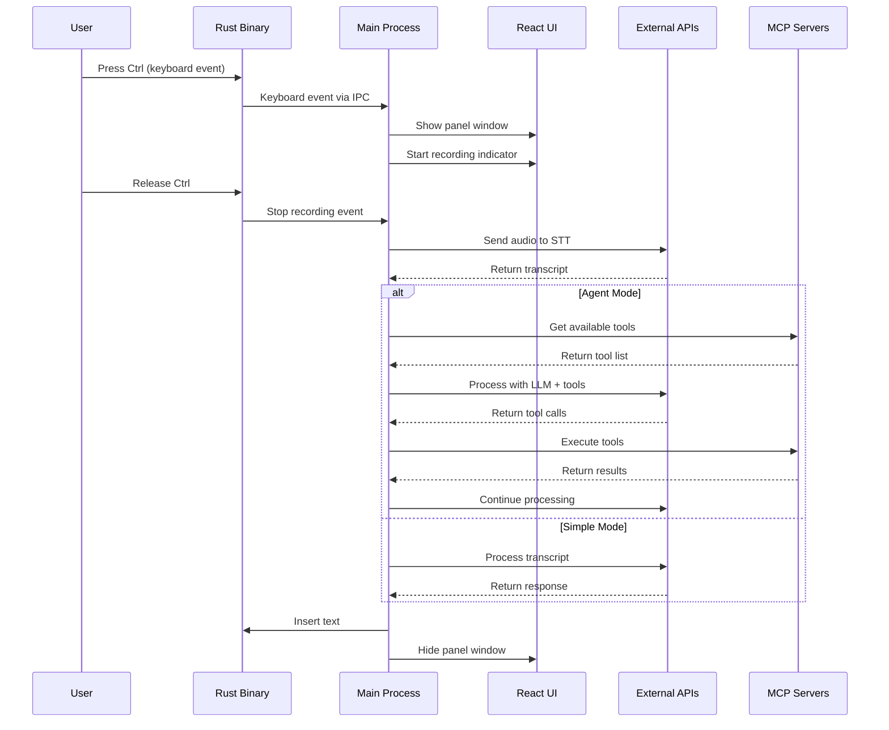
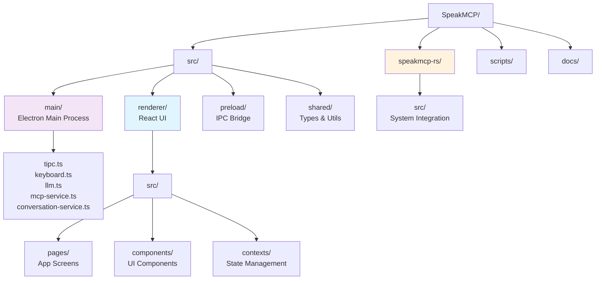
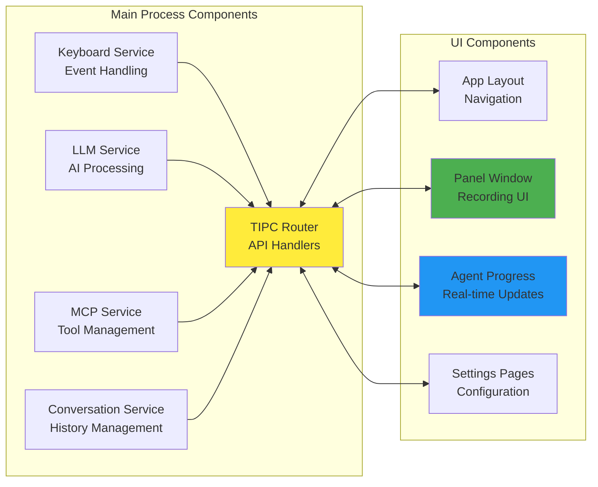
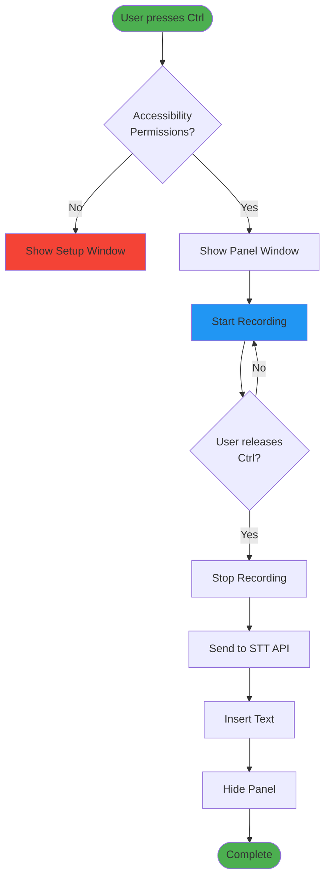
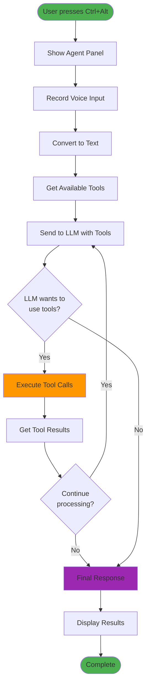
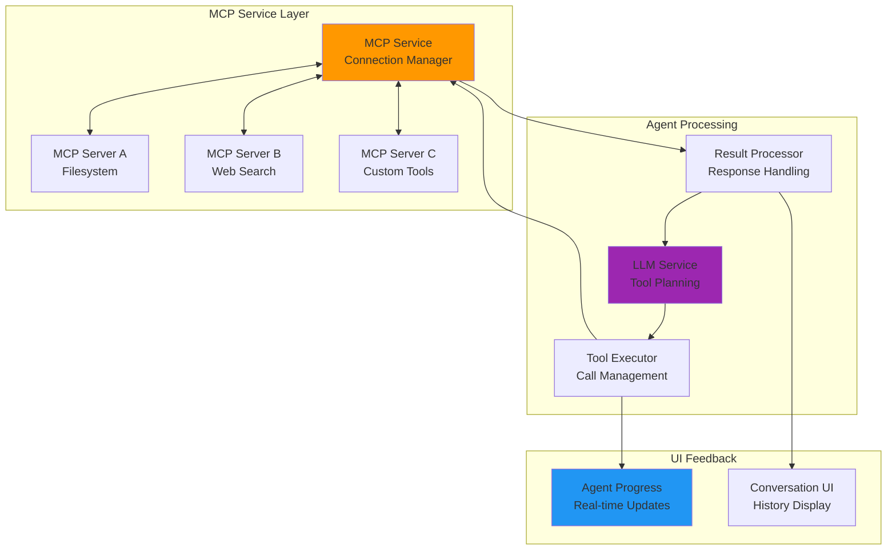
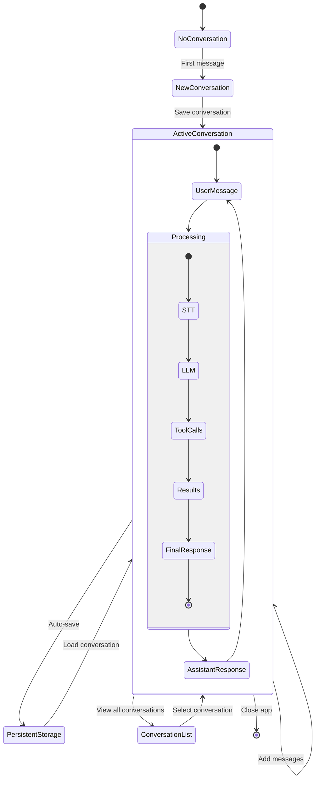
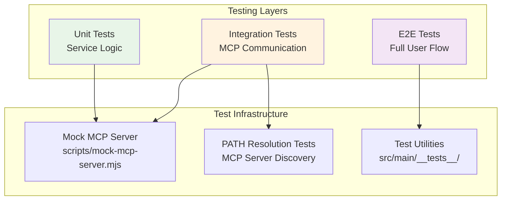

# Contributing to SpeakMCP

Welcome to SpeakMCP! This guide will help you understand the project architecture and get you up and running quickly as a contributor.

## 🚀 Quick Start

### Prerequisites
- **Node.js** 18+ with **pnpm** package manager
- **Rust** toolchain for building the native binary
- **Xcode Command Line Tools** (macOS) or **Visual Studio Build Tools** (Windows)

### Setup
```bash
git clone https://github.com/aj47/SpeakMCP.git
cd SpeakMCP
pnpm install
pnpm build-rs
pnpm dev
```

## 🏗️ Architecture Overview

SpeakMCP is built with a modern, multi-process architecture designed for performance, reliability, and extensibility.

### High-Level System Architecture



### Process Communication Flow



## 📁 Project Structure

### Directory Layout



### Core Components



## 🎯 User Flow Diagrams

### Voice Recording Flow



### Agent Mode Flow



## 🔧 Component Interactions

### MCP Integration Architecture



### Conversation Management



## 🛠️ Development Workflow

### Setting Up Development Environment


### Testing Strategy



## 📋 Contribution Areas

### Priority Areas for Contributors

1. **🐛 Bug Fixes & Stability**
   - MCP server connection issues
   - Keyboard event handling edge cases
   - Memory leaks in long conversations

2. **✨ Feature Enhancements**
   - New MCP server integrations
   - Additional LLM provider support
   - UI/UX improvements

3. **🧪 Testing & Quality**
   - Expand test coverage
   - Add integration tests
   - Performance benchmarking

4. **📚 Documentation**
   - API documentation
   - User guides
   - Architecture deep-dives

### Getting Started Checklist

- [ ] Set up development environment
- [ ] Run existing tests: `pnpm test`
- [ ] Explore the codebase structure
- [ ] Try the mock MCP server: `node scripts/mock-mcp-server.mjs`
- [ ] Read existing issues and discussions
- [ ] Pick a good first issue labeled `good-first-issue`

## 🔍 Key Files to Understand

| File | Purpose | When to Modify |
|------|---------|----------------|
| `src/main/tipc.ts` | IPC API router | Adding new API endpoints |
| `src/main/mcp-service.ts` | MCP client implementation | MCP-related features |
| `src/main/llm.ts` | LLM processing & agent mode | AI processing logic |
| `src/main/keyboard.ts` | Keyboard event handling | Shortcut modifications |
| `src/renderer/src/components/agent-progress.tsx` | Real-time agent UI | Agent feedback improvements |
| `src/shared/types.ts` | Shared type definitions | Adding new data structures |

## 📞 Getting Help

- **Issues**: Check existing issues or create a new one
- **Discussions**: Use GitHub Discussions for questions
- **Documentation**: Refer to `docs/` folder for detailed guides
- **Testing**: See `docs/MCP_TESTING.md` for MCP testing setup

---

Ready to contribute? Pick an issue, follow the development workflow, and help make SpeakMCP even better! 🚀
