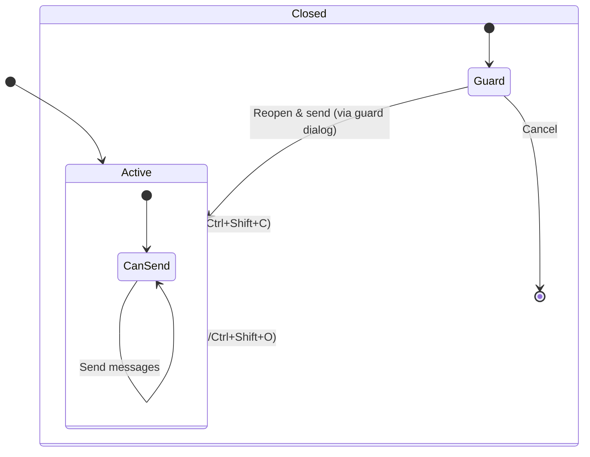
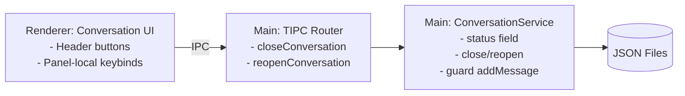

# Phase 1: Conversations Lifecycle and Keybinds

## Objectives
- Add explicit conversation lifecycle: Active and Closed
- Enforce backend guard: no messages to Closed conversations
- Provide close/reopen actions via IPC and minimal UI hooks
- Introduce minimal, robust panel-local keybinds (no global conflicts)

## UX Summary
- Active conversation: normal input; Close action available
- Closed conversation: input disabled with banner; Reopen action available
- If user attempts to send while Closed: show guard dialog (Phase 1.1); for initial code, block and surface a state flag for UI
- Fork: exposed later; not required to ship backend changes

## Minimal Keybind Plan (Panel-local)
- Close conversation: Cmd/Ctrl+Shift+C
- Reopen conversation: Cmd/Ctrl+Shift+O
- Send: Enter; Newline: Shift+Enter; Cancel: Esc (already implemented in text input panel)
- No changes to global hotkeys (recording, text input, MCP, kill switch)

Rationale: Avoid conflicts with existing global shortcuts (Ctrl+W, Ctrl+T, Ctrl+Shift+T, Alt+T). Keep conversation lifecycle shortcuts scoped to the visible panel.

## State Diagram

## Architecture Diagram

## Scope of Changes
- Types
  - Conversation: add `status?: "active" | "closed"`, `closedAt?: number`
- Main
  - conversation-service.ts: default `status=active` on create; implement `closeConversation`, `reopenConversation`; guard in `addMessageToConversation`
  - tipc.ts: add IPC procedures `closeConversation`, `reopenConversation`
- Renderer
  - query-client: add mutations for close/reopen
  - conversation-context: update `endConversation()` to call close; add simple guard in `addMessage()` if closed; expose reopen/close actions for UI
  - Keybind wiring will be added in a follow-up renderer component (header or provider)

## Acceptance (Phase 1 minimal)
- Conversations created with status=active
- Closing marks status=closed and prevents new messages via backend guard
- Reopening sets status=active again
- Renderer uses close in `endConversation()` instead of only clearing local state
- No regressions to existing global shortcuts

---

## Tasklist
1) IN_PROGRESS — Types and Backend lifecycle
   - Add `status` and `closedAt` to Conversation
   - Default `status=active` on create
   - Add `closeConversation`, `reopenConversation`
   - Guard `addMessageToConversation` on closed
   - Add TIPC procedures
2) TODO — Renderer wiring
   - Add close/reopen mutations
   - Update conversation-context endConversation()
   - Add guard (block) in addMessage() when closed
3) TODO — Panel-local keybinds
   - Attach Cmd/Ctrl+Shift+C and Cmd/Ctrl+Shift+O in renderer when panel is visible
   - Tooltips and status chip in header (basic)
4) TODO — Guard dialog (Phase 1.1)
   - Show dialog on send attempt when closed; Enter confirms default action, Esc cancels

