# SpeakMCP Frontend Architecture - Diagram 1

```mermaid
graph TB
    %% Main App Structure
    App[App.tsx] --> Router[React Router]
    App --> ConversationProvider[ConversationProvider Context]
    App --> Updater[Updater Component]
    App --> Toaster[Toaster Notifications]

    %% Router Configuration
    Router --> AppLayout[AppLayout Component]
    Router --> SetupPage[Setup Page]
    Router --> PanelPage[Panel Page]

    %% App Layout and Navigation
    AppLayout --> NavLinks[Navigation Links]
    AppLayout --> Outlet[Router Outlet]
    
    %% Main Pages
    Outlet --> SettingsGeneral[Settings General Page]
    Outlet --> ConversationsPage[Conversations Page]
    Outlet --> SettingsProviders[Settings Providers Page]
    Outlet --> SettingsTools[Settings Tools Page]

    %% Conversation Context State Management
    ConversationProvider --> ConversationState[Conversation State]
    ConversationState --> CurrentConversation[Current Conversation]
    ConversationState --> AgentProgress[Agent Progress State]
    ConversationState --> UIState[UI State Management]

    %% Panel Page Components (Main Voice Interface)
    PanelPage --> AudioVisualizer[Audio Visualizer]
    PanelPage --> RecordingControls[Recording Controls]
    PanelPage --> TextInputPanel[Text Input Panel]
    PanelPage --> ContinueConversation[Continue Conversation]
    PanelPage --> AgentProgressComp[Agent Progress Component]
    PanelPage --> PanelDragBar[Panel Drag Bar]

    %% Conversations Page Components
    ConversationsPage --> ConversationList[Conversation List]
    ConversationsPage --> ConversationSearch[Search & Filter]
    ConversationsPage --> ConversationDisplay[Conversation Display]
    ConversationsPage --> ConversationActions[Delete/View Actions]

    %% Settings Pages Components
    SettingsProviders --> ModelSelector[Model Selector]
    SettingsProviders --> ProviderConfig[Provider Configuration]
    
    SettingsTools --> MCPConfigManager[MCP Config Manager]
    SettingsTools --> MCPToolManager[MCP Tool Manager]

    %% MCP Configuration Components
    MCPConfigManager --> ServerDialog[Server Dialog]
    MCPConfigManager --> ServerList[Server List]
    MCPConfigManager --> ServerStatus[Server Status]
    
    MCPToolManager --> ToolsList[Available Tools]
    MCPToolManager --> ToolsConfig[Tools Configuration]

    %% Conversation Display Components
    ConversationDisplay --> MessageList[Message List]
    ConversationDisplay --> MarkdownRenderer[Markdown Renderer]
    ConversationDisplay --> MessageTypes[User/Bot/Tool Messages]

    %% Shared UI Components
    subgraph UIComponents[Shared UI Components]
        Button[Button]
        Input[Input]
        Card[Card]
        Dialog[Dialog]
        Select[Select]
        Switch[Switch]
        Badge[Badge]
        ScrollArea[Scroll Area]
        LoadingSpinner[Loading Spinner]
        Tooltip[Tooltip]
    end

    %% Data Flow and State Management
    subgraph DataLayer[Data Layer]
        QueryClient[React Query Client]
        TIPCClient[TIPC Client - IPC Bridge]
        ConfigQueries[Config Queries]
        ConversationQueries[Conversation Queries]
        MCPQueries[MCP Queries]
    end

    %% Hooks and Utilities
    subgraph Hooks[Custom Hooks]
        UseInputProcessing[useInputProcessing]
        UseConversationActions[useConversationActions]
        UseConversationState[useConversationState]
    end

    %% External Integrations
    subgraph External[External Systems]
        ElectronMain[Electron Main Process]
        MCPServers[MCP Servers]
        AudioRecorder[Audio Recorder]
        STTProviders[STT Providers]
        LLMProviders[LLM Providers]
    end

    %% Data Flow Connections
    ConversationProvider -.-> QueryClient
    QueryClient -.-> TIPCClient
    TIPCClient -.-> ElectronMain
    
    PanelPage -.-> AudioRecorder
    PanelPage -.-> UseInputProcessing
    
    MCPConfigManager -.-> MCPServers
    SettingsProviders -.-> STTProviders
    SettingsProviders -.-> LLMProviders
    
    %% Component Usage Relationships
    ConversationsPage --> UIComponents
    PanelPage --> UIComponents
    SettingsProviders --> UIComponents
    SettingsTools --> UIComponents
    ConversationDisplay --> UIComponents
    MCPConfigManager --> UIComponents

    %% Context Usage
    PanelPage -.-> ConversationProvider
    ConversationsPage -.-> ConversationProvider
    ConversationDisplay -.-> ConversationProvider

    %% Styling
    classDef mainComponent fill:#e1f5fe
    classDef pageComponent fill:#f3e5f5
    classDef contextComponent fill:#e8f5e8
    classDef uiComponent fill:#fff3e0
    classDef dataComponent fill:#fce4ec
    classDef externalComponent fill:#f1f8e9

    class App,Router,AppLayout mainComponent
    class PanelPage,ConversationsPage,SettingsProviders,SettingsTools,SetupPage pageComponent
    class ConversationProvider,ConversationState contextComponent
    class UIComponents,Button,Input,Card,Dialog uiComponent
    class QueryClient,TIPCClient,ConfigQueries dataComponent
    class ElectronMain,MCPServers,AudioRecorder externalComponent
```

This diagram shows the complete frontend architecture of SpeakMCP, including:

**Main Structure:**
- App component with router and global providers
- Three main routes: AppLayout (settings), Setup, and Panel (voice interface)

**Key Pages:**
- **Panel Page**: The main voice interface with audio recording, visualization, and conversation controls
- **Conversations Page**: History and management of past conversations
- **Settings Pages**: Configuration for providers, tools, and general settings

**State Management:**
- ConversationProvider context managing conversation state across the app
- React Query for server state management
- TIPC client for IPC communication with Electron main process

**Core Features:**
- Voice recording and transcription
- Real-time conversation display with markdown rendering
- MCP (Model Context Protocol) server and tool management
- Provider configuration for STT and LLM services
- Agent progress tracking and visualization

The diagram illustrates how components interact through the conversation context, shared UI components, and the data layer that connects to external services via the Electron main process.
