# SpeakMCP Frontend Architecture - Diagram 2

```mermaid
graph TB
    %% Entry Point
    Main[main.tsx<br/>Entry Point] --> App[App.tsx<br/>Root Component]
    
    %% Core App Structure
    App --> QueryProvider[QueryClientProvider<br/>React Query]
    App --> ConversationProvider[ConversationProvider<br/>Global State]
    App --> Router[RouterProvider<br/>React Router]
    App --> Updater[Updater Component<br/>Auto-updates]
    App --> Toaster[Toaster<br/>Notifications]
    
    %% Router and Layout
    Router --> AppLayout[app-layout.tsx<br/>Main Layout]
    AppLayout --> Sidebar[Navigation Sidebar]
    AppLayout --> Outlet[Router Outlet<br/>Page Content]
    
    %% Pages
    Outlet --> SettingsGeneral[settings-general.tsx<br/>General Settings]
    Outlet --> SettingsProviders[settings-providers.tsx<br/>Provider Config]
    Outlet --> SettingsTools[settings-tools.tsx<br/>Agent/Tool Config]
    Outlet --> ConversationsPage[conversations.tsx<br/>Conversation History]
    Outlet --> SetupPage[setup.tsx<br/>Initial Setup]
    Outlet --> PanelPage[panel.tsx<br/>Floating Panel]
    
    %% Key Components
    ConversationsPage --> ConversationDisplay[conversation-display.tsx<br/>Message Display]
    ConversationsPage --> ConversationCard[ConversationCard<br/>History Items]
    
    PanelPage --> TextInputPanel[text-input-panel.tsx<br/>Text Input UI]
    PanelPage --> ContinueConversation[continue-conversation.tsx<br/>Continue Chat]
    PanelPage --> PanelDragBar[panel-drag-bar.tsx<br/>Drag Handle]
    
    SettingsProviders --> MCPConfigManager[mcp-config-manager.tsx<br/>MCP Server Config]
    SettingsTools --> MCPToolManager[mcp-tool-manager.tsx<br/>Tool Management]
    
    %% Shared Components
    ConversationDisplay --> MarkdownRenderer[markdown-renderer.tsx<br/>Message Formatting]
    ConversationDisplay --> AgentProgress[agent-progress.tsx<br/>Progress Display]
    TextInputPanel --> AgentProgress
    PanelPage --> AgentProgress
    
    %% UI Components
    ConversationDisplay --> UICard[UI Components<br/>Card, Badge, ScrollArea]
    TextInputPanel --> UITextarea[UI Components<br/>Textarea, Button]
    MCPConfigManager --> UIDialog[UI Components<br/>Dialog, Input, Select]
    ConversationsPage --> UIButton[UI Components<br/>Button, Input, Dialog]
    
    %% Context and State
    ConversationProvider --> ConversationContext[conversation-context.tsx<br/>State Management]
    ConversationContext --> ConversationActions[Conversation Actions<br/>CRUD Operations]
    ConversationContext --> ConversationState[Conversation State<br/>Current Chat Data]
    
    %% Data Layer
    QueryProvider --> QueryClient[query-client.ts<br/>API Queries]
    QueryClient --> TipcClient[tipc-client.ts<br/>IPC Communication]
    
    %% Hooks
    ConversationContext --> UseConversation[useConversation Hook]
    ConversationContext --> UseConversationState[useConversationState Hook]
    PanelPage --> UseInputProcessing[use-input-processing.ts<br/>Input Handling]
    
    %% Data Flow
    TipcClient -.->|IPC Messages| Main[Main Process]
    ConversationActions -.->|State Updates| ConversationState
    UseConversation -.->|Context Data| ConversationDisplay
    UseConversation -.->|Context Data| TextInputPanel
    UseConversation -.->|Context Data| PanelPage
    
    %% Styling
    classDef page fill:#e1f5fe,stroke:#01579b,stroke-width:2px
    classDef component fill:#f3e5f5,stroke:#4a148c,stroke-width:2px
    classDef context fill:#e8f5e8,stroke:#1b5e20,stroke-width:2px
    classDef ui fill:#fff3e0,stroke:#e65100,stroke-width:2px
    classDef data fill:#fce4ec,stroke:#880e4f,stroke-width:2px
    
    class SettingsGeneral,SettingsProviders,SettingsTools,ConversationsPage,SetupPage,PanelPage page
    class ConversationDisplay,TextInputPanel,MCPConfigManager,AgentProgress,MarkdownRenderer component
    class ConversationProvider,ConversationContext,UseConversation,UseConversationState context
    class UICard,UITextarea,UIDialog,UIButton ui
    class QueryClient,TipcClient,QueryProvider data
```

This diagram shows the frontend architecture of SpeakMCP with the following key aspects:

## **Main Architecture Layers:**

1. **Entry Point**: `main.tsx` bootstraps the React app with providers
2. **Root Component**: `App.tsx` sets up global providers and routing
3. **Layout**: `app-layout.tsx` provides the main UI structure with sidebar navigation
4. **Pages**: Different views for settings, conversations, setup, and the floating panel
5. **Components**: Reusable UI components for specific functionality
6. **Context/State**: Global state management for conversations
7. **Data Layer**: React Query for API calls and IPC communication

## **Key Interactions:**

- **ConversationProvider** wraps the entire app and manages conversation state
- **Router** handles navigation between different pages/views
- **Panel Page** is the main interaction point (floating overlay for voice/text input)
- **Conversation Display** shows chat history with markdown rendering and agent progress
- **MCP Config Manager** handles configuration of external tools and servers
- **IPC Communication** connects frontend to Electron main process via `tipc-client`

## **Data Flow:**

- User interactions flow through React components
- State changes are managed by ConversationContext
- API calls go through React Query to the main process via IPC
- Real-time updates (like agent progress) are pushed from main process to renderer

The architecture follows a typical React pattern with context for global state, React Router for navigation, and React Query for data fetching, all wrapped in an Electron renderer process.
