# SpeakMCP Frontend Architecture - Diagram 3

```mermaid
graph TB
    %% Main App Structure
    App[App.tsx] --> ConversationProvider[ConversationProvider]
    App --> RouterProvider[RouterProvider]
    App --> Updater[Updater Component]
    App --> Toaster[Toaster]

    %% Router Structure
    RouterProvider --> Router[router.tsx]
    Router --> AppLayout[AppLayout Component]
    Router --> SetupPage[Setup Page]
    Router --> PanelPage[Panel Page]

    %% App Layout and Navigation
    AppLayout --> NavLinks[Navigation Links]
    AppLayout --> Outlet[Router Outlet]
    
    %% Main Pages
    Outlet --> SettingsGeneral[Settings General Page]
    Outlet --> ConversationsPage[Conversations Page]
    Outlet --> SettingsProviders[Settings Providers Page]
    Outlet --> SettingsTools[Settings Tools Page]

    %% Conversation Context
    ConversationProvider --> ConversationContext[Conversation Context]
    ConversationContext --> ConversationState[Conversation State]
    ConversationContext --> ConversationActions[Conversation Actions]

    %% Panel Page Components
    PanelPage --> TextInputPanel[Text Input Panel]
    PanelPage --> AgentProgress[Agent Progress]
    PanelPage --> ContinueConversation[Continue Conversation]
    PanelPage --> PanelDragBar[Panel Drag Bar]
    PanelPage --> Recorder[Audio Recorder]

    %% Conversations Page Components
    ConversationsPage --> ConversationDisplay[Conversation Display]
    ConversationsPage --> ConversationHistory[Conversation History]
    ConversationsPage --> SearchFilter[Search & Filter]

    %% Settings Components
    SettingsProviders --> ModelSelector[Model Selector]
    SettingsTools --> MCPConfigManager[MCP Config Manager]
    SettingsTools --> MCPToolManager[MCP Tool Manager]

    %% MCP Management
    MCPConfigManager --> ServerDialog[Server Dialog]
    MCPConfigManager --> ServerStatus[Server Status]
    MCPToolManager --> ToolsList[Tools List]
    MCPToolManager --> ToolsStatus[Tools Status]

    %% UI Components Layer
    TextInputPanel --> UITextarea[UI Textarea]
    ConversationDisplay --> MarkdownRenderer[Markdown Renderer]
    AgentProgress --> UISpinner[UI Spinner]
    AgentProgress --> UIBadge[UI Badge]

    %% Shared UI Components
    UIComponents[UI Components] --> UIButton[Button]
    UIComponents --> UICard[Card]
    UIComponents --> UIDialog[Dialog]
    UIComponents --> UIInput[Input]
    UIComponents --> UISelect[Select]
    UIComponents --> UISwitch[Switch]
    UIComponents --> UITooltip[Tooltip]
    UIComponents --> UIScrollArea[Scroll Area]

    %% Data Flow
    ConversationContext -.-> QueryClient[Query Client]
    QueryClient -.-> TipcClient[TIPC Client]
    TipcClient -.-> MainProcess[Main Process]

    %% Hooks
    PanelPage --> UseInputProcessing[useInputProcessing Hook]
    ConversationsPage --> UseConversationQuery[useConversationQuery]
    SettingsTools --> UseConfigQuery[useConfigQuery]

    %% Styling
    classDef page fill:#e1f5fe
    classDef component fill:#f3e5f5
    classDef context fill:#e8f5e8
    classDef ui fill:#fff3e0
    classDef data fill:#fce4ec

    class SettingsGeneral,ConversationsPage,SettingsProviders,SettingsTools,SetupPage,PanelPage page
    class TextInputPanel,AgentProgress,ConversationDisplay,MCPConfigManager,ModelSelector,MarkdownRenderer component
    class ConversationProvider,ConversationContext context
    class UIButton,UICard,UIDialog,UIInput,UISelect,UISwitch,UITextarea,UISpinner,UIBadge ui
    class QueryClient,TipcClient,UseInputProcessing,UseConversationQuery,UseConfigQuery data
```

This diagram shows the key aspects of the SpeakMCP frontend architecture:

## **Main Structure:**
- **App.tsx** serves as the root component with ConversationProvider wrapping everything
- **Router** handles navigation between different pages and views
- **AppLayout** provides the main navigation structure

## **Key Pages:**
- **Panel Page**: The main interaction interface with voice recording, text input, and agent progress
- **Conversations Page**: Displays conversation history and management
- **Settings Pages**: Configuration for providers, tools, and general settings
- **Setup Page**: Initial application setup

## **Core Components:**
- **ConversationProvider/Context**: Manages conversation state across the app
- **TextInputPanel**: Handles text input with agent progress display
- **MCPConfigManager**: Manages MCP server configurations
- **AgentProgress**: Shows real-time agent processing status
- **MarkdownRenderer**: Renders conversation messages

## **Data Flow:**
- Components interact with the **ConversationContext** for state management
- **Query Client** handles data fetching and caching
- **TIPC Client** communicates with the Electron main process
- **Hooks** provide reusable logic for input processing and data queries

The architecture follows a clean separation of concerns with React Context for state management, React Router for navigation, and a component-based UI structure using shadcn/ui components.
